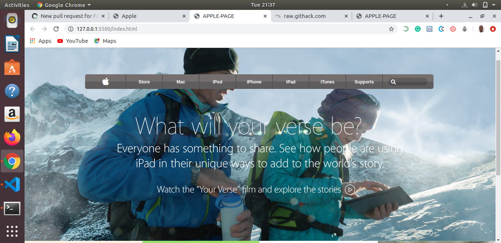

# Apple-Clone

> This project consists of building an HTML document that matches the appearance of an article from The Apple Website Page.[https://web.archive.org/web/20140301004610/http://www.apple.com/]

-Live Demo [https://raw.githack.com/AdesojiCodeMaster/Apple-Clone/feature-apple_clone/index.html]

## Built With

- HTML
- CSS

## Author

 👤 Adesoji Adewumi

- Github: @AdesojiCodeMaster
- Twitter: @CodeMas22665735
- Linkedin: https://www.linkedin.com/in/adesoji-adewumi

## 🤝 Contributing

Contributions, issues and feature requests are welcome!

Feel free to check the [issues page](https://github.com/AdesojiCodeMaster/Apple-Clone/issues).

## Show your support

Give a ⭐️ if you like this project!

## 📝 License

This project is [MIT](lic.url) licensed.

