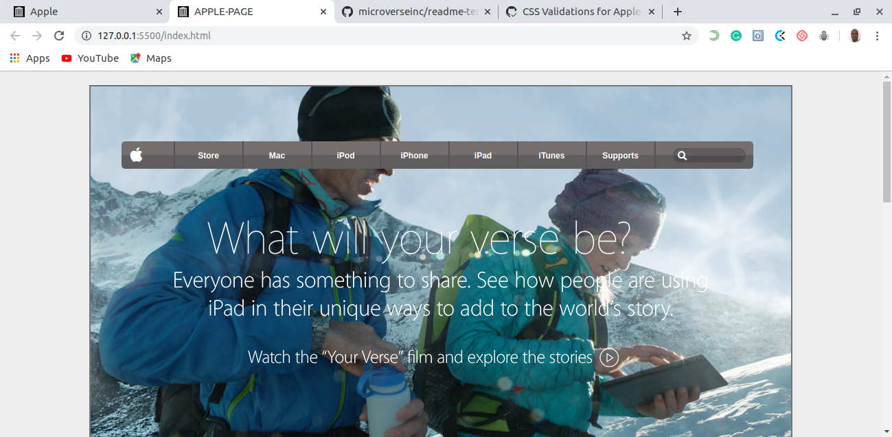

# Apple-Clone

> This project consists of building an HTML document that matches the appearance of an article from The Apple Website Page.

-Live Demo [https://rawcdn.githack.com/AdesojiCodeMaster/Apple-Clone/8c86152c86ea02b01b1d2c2a513accfd1f392227/index.html]

## Built With

- HTML
- CSS

## Author

 👤 Adesoji Adewumi

- Github: @AdesojiCodeMaster
- Twitter: @CodeMas22665735
- Linkedin: https://www.linkedin.com/in/adesoji-adewumi-7752aba5

## 🤝 Contributing

Contributions, issues and feature requests are welcome!

Feel free to check the [issues page](https://github.com/AdesojiCodeMaster/Apple-Clone/issues).

## Show your support

Give a ⭐️ if you like this project!

## 📝 License

This project is [MIT](lic.url) licensed.

